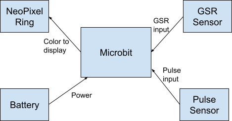
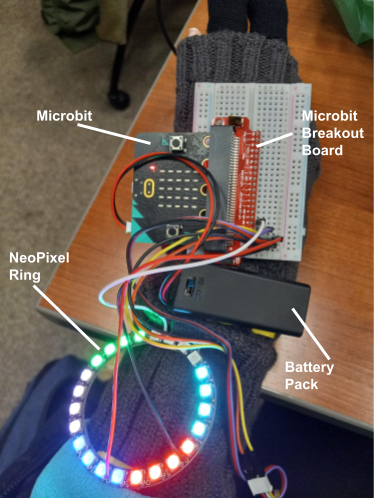
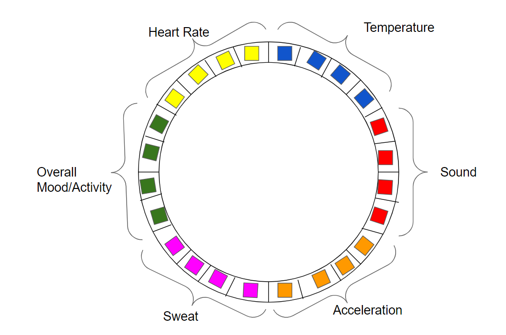
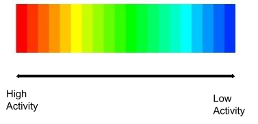
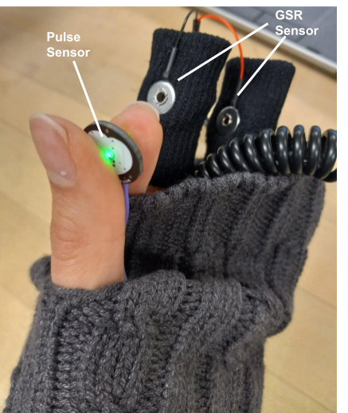
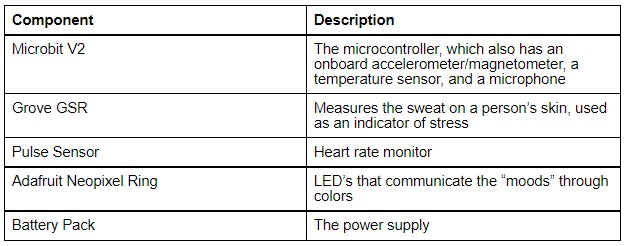
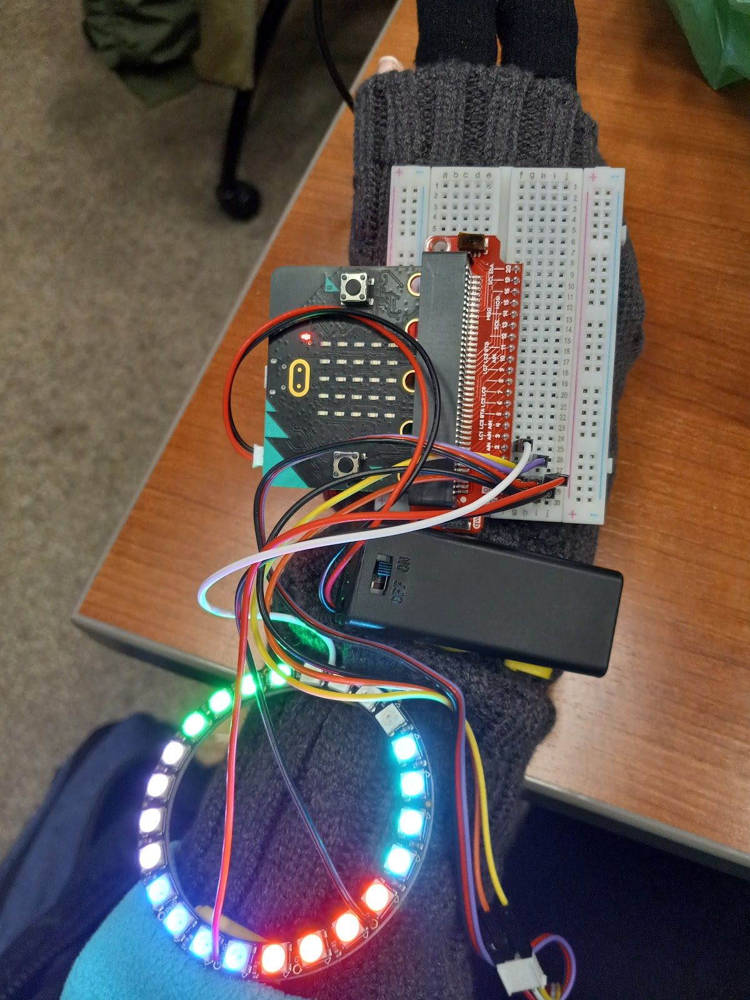
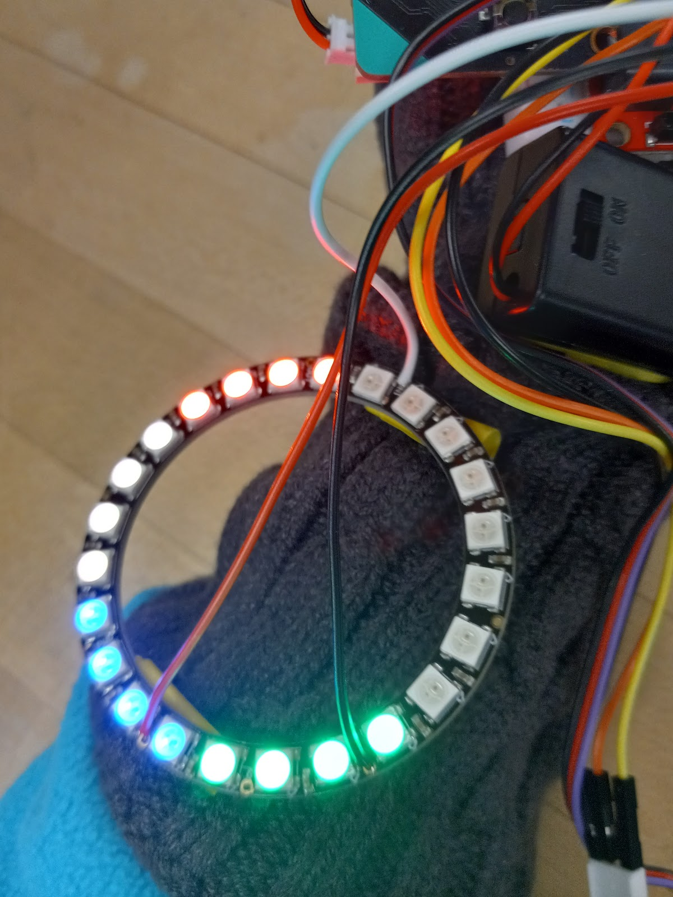

# Activity Meter Glove: A Glove that Communicates Environmental Activity Using Color

Group Members: Therese Schachner and Sharon Obiefuna

## Executive Summary
A common function of wearable devices is sensing the environment, processing the information collected, and displaying the results in a useful manner. One such device is the mood ring, which uses temperature readings to display colors representing the user’s mood. However, there are many other factors in addition to temperature that can determine mood or activity in an environment. As a result, we have created the Activity Meter Glove, which determines mood or activity based on five sensor readings: temperature, sound, acceleration, the user’s pulse, and the user’s GSR (galvanic sweat response). Since the Activity Meter Glove collects a relatively wide range of data about the environment, the information it displays about environmental activity is relatively well informed.

Block Diagram

Figure 1: System Design. The battery powers the Microbit, which has built-in sensors for temperature, sound, and acceleration. The Microbit processes these sensor inputs, along with GSR and pulse information communicated through their respective sensors, to calculate the colors that should be displayed and communicate them to the NeoPixel ring.

Visual Story 
Back of the Glove

Figure 2: The components on the back of the glove.

Figure 3: A map of the NeoPixel ring showing the LEDs allocated to each sensory input, as well as sample colors for each LED.

Figure 4: The color range for each of the NeoPixel LEDs. Each LED displays a color ranging from red, indicating high activity (such as loud sound or high temperature), to blue, indicating low activity (such as quiet sound or low temperature).

Front of the Glove

Figure 5: The front view of the glove, from which the pulse sensor and GSR sensors are visible.
Components Table

Component
Description
Microbit V2
The microcontroller, which also has an onboard accelerometer/magnetometer, a temperature sensor, and a microphone
Grove GSR
Measures the sweat on a person’s skin, used as an indicator of stress
Pulse Sensor
Heart rate monitor
Adafruit Neopixel Ring
LED’s that communicate the “moods” through colors
Battery Pack
The power supply

Figure 6: The Activity Meter Glove’s hardware components.

Implementation
Software
The device was programmed using Micropython, mainly using the microbit and neopixel packages. For each of the five sensors, a sensor reading is obtained once every 250 milliseconds. This sensor reading is used to calculate and set the color shown on the 4 NeoPixel LEDs allocated for that sensor. This NeoPixel color ranges from red, if its sensors indicate the highest activity levels, such as high acceleration and high pulse rate measurements, to blue if its sensors indicate the lowest activity levels, such as minimal sound activity and low temperature. There are also 4 NeoPixel LEDs that display the overall activity, which is the average of the colors corresponding to each of the 5 sensors.

Hardware and Mechanics
The hardware and mechanical implementation was pretty straightforward. We connected the Microbit to the Sparkfun pin breakout board and used 3 analog input pins total, for the external sensors and the NeoPixel Ring. More information about the interaction among the hardware components can be found in the block diagram on page 1.

We soldered the wires attaching to the NeoPixel, but most of the other wired connections proved to be stable enough without the need for soldering. We found that the glue on the bottom of our breadboard and electrical tape were sufficient for constructing a relatively sturdy prototype.

Pictures

Figure 7: The colors displayed when the user’s heart rate is at a medium level, sweating is at a low level, hand acceleration is fast, the ambient noise is relatively quiet, and the overall environmental activity is at a relatively calm level. The temperature LEDs are off since these LEDs change color only when the temperature detected is very high or very low. 

Figure 8: The colors displayed when the user’s pulse is fast, sweat activity is low, and hand acceleration is at a medium level, The temperature and sound sensors are not activated since room temperature and minimal noise are detected.

Lessons Learned
The on board sensors were sufficient for our prototype. However it would be ideal to use separate dedicated and reliable sensors. For instance, we didn’t realize at first that the accelerometer readings we received also had orientation/angles factored in. We were strictly interested in only the acceleration component. Next time we would prefer an inertial measurement unit. We also had problems with the GSR, which we assumed would have a consistent baseline reading but we noticed that it varied.
The form factor of our design could be vastly improved. We were more focused on creating a functioning prototype, but realistically users would likely prefer a product that is more compact. For the scope of this class it is not very feasible but we could design a flex PCB, which would have allowed us a lot more control in our design.
Over the course of our project, our product became less of a mood watch, which was our original idea, and more of an environmental stress communicator.The average person can likely get similar or better information from just about any smart watch. In future designing it would be interesting to explore what we could implement to make it stand out more from existing smart watches. 
